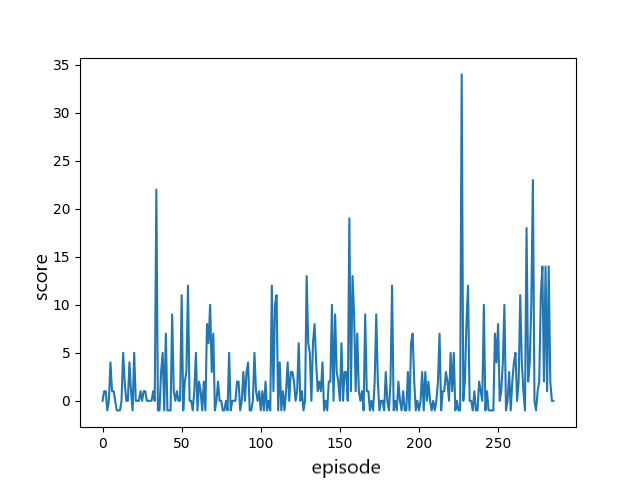

# ml-reinforcement-game
In this repo, i created a Deep Reinforcement Learning Model on a custom OpenAI Gym environment game.
### Setup
Make sure to download the air raid environment:
```
pip install -e air_raid
```
### The game 
The Air Raid game includes a player (agent) that can go left or right and get a +1 reward when colliding with a green square and will be getting a -1 reward and lose the game when colliding with a red square.

### The model training 

During training (every 10000 steps) , the wights of the model will be saved in a test_dqn_air_raid_weights.h5f fille.
This wights can be used later in the code to test the model preformence.

Once the training is complete, a score per episode (game) graph will be generated .


Example of the agent playing the game after training for 400 episodes.

https://user-images.githubusercontent.com/112412039/189638186-0f438e4b-4078-471d-a894-7a8b4cf2dee8.mp4


